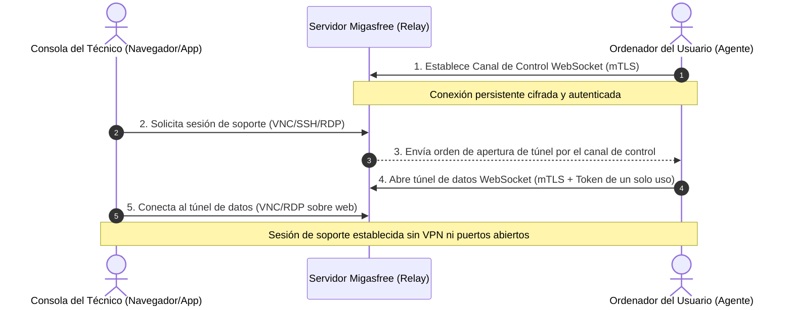

En entornos corporativos y administraciones públicas distribuidas, el soporte remoto tradicional (como VNC, SSH o RDP) suele requerir una infraestructura compleja de VPN o la exposición peligrosa de puertos en cortafuegos públicos.

A partir de la **versión 5** de la suite, **Migasfree** resuelve este problema mediante una arquitectura de **Túneles WebSocket seguros basados en mTLS (Mutual TLS)**, que permite a los técnicos realizar asistencia remota con un enfoque de confianza cero (_Zero Trust_), incluso para equipos ubicados detrás de NATs y firewalls estrictos.

::: info Requisitos de versión
Esta arquitectura de túneles de datos bajo demanda y el canal de señalización WebSocket requieren la versión 5 tanto en el servidor (`migasfree-backend`) como en el cliente de la flota (`migasfree-client` y `migasfree-agent`).
:::

---

## ¿Cómo funciona el túnel seguro?

El modelo de comunicación tradicional ("Push") requiere que el técnico se conecte activamente a la dirección IP del cliente. Esto falla cuando el usuario trabaja desde casa o se encuentra en una red privada.

Migasfree utiliza un modelo "Pull-Push híbrido" en el que el cliente inicia la conexión hacia el servidor, sorteando cualquier cortafuegos intermedio:

### El proceso paso a paso

1. **Establecimiento del Canal de Control:** El demonio del cliente (`migasfree-agent` / `migasfree-client`) se conecta al servidor de Migasfree (o un servidor de Relay) mediante un WebSocket persistente, autenticándose mutuamente mediante certificados X.509 de cliente (mTLS).
2. **Petición del Técnico:** Un técnico solicita conectarse a la máquina remota desde el panel de control de `migasfree-frontend`.
3. **Señalización:** El servidor de Migasfree envía un mensaje de señalización al cliente a través del WebSocket de control existente.
4. **Creación del Túnel:** El agente cliente inicia una nueva conexión de datos WebSocket hacia el servidor de Relay y la vincula al puerto de servicio local (por ejemplo, el puerto 5900 para VNC o 22 para SSH).
5. **Establecimiento de la Asistencia:** El servidor de Relay une ambos extremos, permitiendo al técnico controlar la pantalla o la terminal a través de una interfaz HTML5 segura en su navegador, sin necesidad de que el cliente o el técnico compartan una red común.

---

## Ventajas de Seguridad de Confianza Cero (Zero Trust)

### 1. Autenticación Mutua Fuerte (mTLS)

Ninguna conexión de túnel es aceptada sin un certificado digital de cliente válido emitido por la Autoridad de Certificación (CA) de Migasfree. Esto previene ataques de suplantación de identidad e impide que atacantes externos intenten abrir túneles o falsificar solicitudes de asistencia.

### 2. Sin Puertos Expuestos a Internet

Los equipos cliente no tienen puertos abiertos escuchando en la red pública. El agente realiza una conexión de salida (egress) al servidor de control. Esto reduce a cero la superficie de ataque frente a escaneos de puertos y exploits dirigidos a protocolos de asistencia remota (como las vulnerabilidades clásicas de RDP o VNC).

### 3. Tokens de Sesión Efímeros

Las sesiones de datos están protegidas por tokens criptográficos firmados digitalmente (mediante JWS) que expiran en pocos minutos. Un token solo sirve para autorizar la conexión solicitada y queda invalidado inmediatamente después de que se establece la sesión de soporte o expira el tiempo límite.

### 4. Auditoría Centralizada

Todas las solicitudes de inicio de túnel, conexiones activas y desconexiones quedan registradas con marcas de tiempo en el servidor de Migasfree, asegurando una trazabilidad completa para auditorías de cumplimiento normativo (como la ISO 27001 o el Esquema Nacional de Seguridad).

---

## Beneficios Operativos para la Organización

- **Soporte a usuarios en teletrabajo:** El sistema funciona a través de cualquier conexión de banda ancha residencial, redes móviles (4G/5G) o redes Wi-Fi públicas de hoteles y cafeterías.
- **Ahorro en Licencias de Terceros:** Elimina la necesidad de adquirir licencias adicionales de software de soporte propietario (como TeamViewer, AnyDesk o LogMeIn).
- **Cero Configuración de VPN:** El personal de TI no tiene que configurar, mantener o dar soporte a clientes VPN para que los técnicos puedan asistir a los usuarios domésticos.
- **Control y Consentimiento:** La conexión puede requerir la confirmación visual en pantalla del usuario antes de que el técnico tome el control, respetando la privacidad del empleado.
